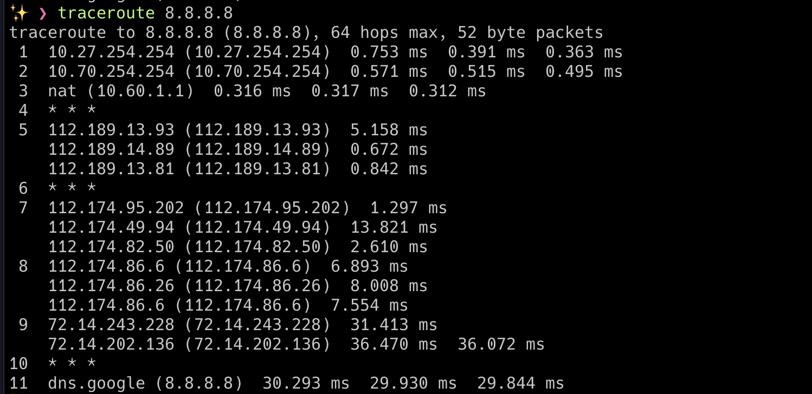

# Netpractice

This project is a general practical exercise to let you discover networking

## Topic

 Lv. 1 

 Lv. 2 

 Lv. 3 

 Lv. 4 

 Lv. 5 

 Lv. 6 

 Lv. 7 

 Lv. 8 

기본적으로 각 대역폭당 독립적인 ip 영역을 가지고 있으면 됨.
하지만 인터넷과 통신하므로, private ip를 갖고 있으면 요청을 보낼 순 있지만 받을 순 없음.
따라서 범위를 잘 지정해서 넣어야함.

 Lv. 9 

 Lv. 10 

 network 관련  

`traceroute` 명령어로 라우팅 되는 과정 볼 수 있음 (8.8.8.8 = google)

`nslookup` 명령어로 특정 도메인의 ip or 그 반대를 알 수 있음

`net-server` 서버를 열어줌...?

`nettop` 소켓과 라우터들의 리스트를 보여줌

`netbios` 넷 바이오스...?

`networksetup` 컴퓨터에 연결된 네트워크 정보들

`netstat` network status

`netstat -rn` route table

`netstat -an` 포트 확인

`lsof -i -n` 인터넷과 네트워크 파일들의 listening 상태확인
`lsof -i TCP ` TCP 상태 확인

`nc [HOST] [PORT] ` TCP 연결, UDP 패킷 전송 등등 TCP UDP 관련 많은걸 하게 해줌.

`wireshark` 라는 프로그램을 이용하여 패킷 캡쳐 가능. 패킷들의 구조를 알 수 있고, TCP 같은 프로토콜이 어떤식으로 진행되는지 파악하기 쉬움.

# Reference

[IBM TCP/IP](https://www.ibm.com/docs/ko/aix/7.1?topic=management-transmission-control-protocolinternet-protocol)
